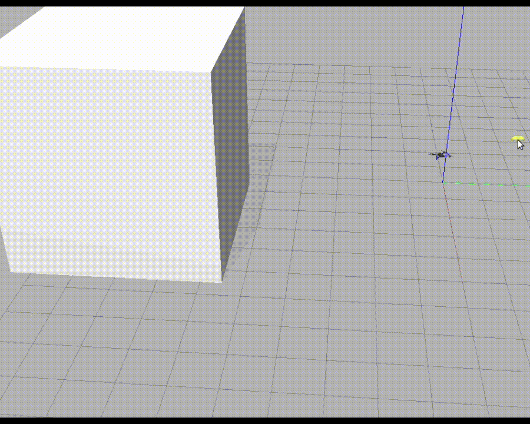

# UAV Testing Competition

<p align="center">
  
  
</p>

This repository is a fork of the [UAV Testing Competition](https://github.com/skhatiri/UAV-Testing-Competition) starter material. It bundles the sample case studies, a runnable random generator, helper launch scripts, and the Docker environment used to build test generators on top of [Aerialist](https://github.com/skhatiri/Aerialist).

## Competition Context

Unmanned Aerial Vehicles (UAVs) are increasingly used in real-world scenarios such as crop monitoring, surveillance, and delivery. Open platforms such as [PX4](https://github.com/PX4/PX4-Autopilot) and [Ardupilot](https://github.com/ArduPilot/ardupilot) have made development easier, but systematic testing is still a major challenge.

The UAV Testing Competition is organised jointly with [ICST 2026](https://conf.researchr.org/home/icst-2026) and [SBFT@ICSE 2026](https://search-based-and-fuzz-testing.github.io/sbft26/) to support researchers exploring testing techniques for autonomous drones.

## Repository Layout

- [`README.md`](README.md): project overview and onboarding
- [`run.sh`](run.sh), [`run.ps1`](run.ps1): Linux/macOS and Windows helpers to enter the Docker environment
- [`docker/`](docker): compose files for the GPU, CPU-only and Windows setups
- [`snippets/Dockerfile`](snippets/Dockerfile): image used by the coordinator and by the simulator workers
- [`snippets/cli.py`](snippets/cli.py): entry point; the generator is selected by the `GENERATOR` constant at the top
- [`snippets/geneticAlgorithm/`](snippets/geneticAlgorithm): the genetic test generator
  - `mission.py`, `geometry.py`, `genes.py`, `motifs.py`, `suite.py`, `generator.py`: the search, split by concern
  - `tests/`: unit tests that run without the simulator
- [`snippets/random_generator.py`](snippets/random_generator.py): the sample random generator, kept as the baseline
- [`snippets/testcase.py`](snippets/testcase.py), [`snippets/parallel_docker_agent.py`](snippets/parallel_docker_agent.py): execution of one test, locally or in a disposable worker container
- [`snippets/patchAerialist.py`](snippets/patchAerialist.py): small patches to the Aerialist library applied at build and at start
- [`snippets/case_studies/`](snippets/case_studies): missions 1-3 from the competition and missions 4-7 added by the team
- [`snippets/requirements.txt`](snippets/requirements.txt): extra Python dependencies for the generator

## Prerequisites

- Docker Engine with the Compose v2 plugin (`docker compose`, not `docker-compose`). The image is about 11 GB on disk.
- For the default Linux profile: an NVIDIA GPU with the driver and the [NVIDIA Container Toolkit](https://docs.nvidia.com/datacenter/cloud-native/container-toolkit/latest/install-guide.html). Without them use `./run.sh --nogpu`, which renders in software.
- `xauth` on the host for the GPU profile (see the cookie step below).
- On Windows: Docker Desktop and PowerShell. The Windows profile runs one local simulation at a time; the two Linux profiles start one disposable simulator container per test (4 in parallel with a GPU, 2 without).

Run the helpers from the repository root; they locate the compose files by relative path.

## Quick Start

### Linux / macOS

The GPU profile shares the host X display with the simulator workers and reads the X cookie from `~/.docker-xauth`. Create that file once before the first start (and again after a reboot, which invalidates the cookie); if it does not exist Docker creates a directory in its place and every simulation times out with the drone at home.

```bash
xauth nlist "$DISPLAY" | sed -e 's/^..../ffff/' | xauth -f ~/.docker-xauth nmerge -
```

```bash
./run.sh             # build on first use, start the GPU container, open a shell in it
./run.sh --nogpu     # CPU-only container (no cookie step needed)
./run.sh --rebuild   # rebuild after editing snippets/Dockerfile or requirements.txt
./run.sh --sim generate case_studies/mission1.yaml 5   # run the generator without opening a shell
```

### Windows

```powershell
.\run.ps1            # start (or attach to) the container
.\run.ps1 -Rebuild   # rebuild after editing snippets/Dockerfile or requirements.txt
.\run.ps1 --sim generate case_studies/mission1.yaml 5
```

The helpers attach to an interactive shell inside the `uav-testing` service. The host `snippets/` folder is mounted at `/src/generator` so edits made on the host are visible inside the container.

## Running a Test Generator

Once inside the container, invoke the entry point with the `generate` subcommand:

```bash
cd /src/generator
python3 cli.py generate case_studies/mission1.yaml 5
```

This gives the selected generator a budget of `5` simulations on `mission1.yaml` and writes the resulting tests under `snippets/generated_tests/`. The genetic generator wants a budget of about 100: 20 seeds, three to four generations of children, and confirmation reruns of the best layouts. The active generator is chosen by the `GENERATOR` constant at the top of [`snippets/cli.py`](snippets/cli.py) (`"ga"` for the genetic algorithm, `"random"` for the baseline random generator).

## How the Generator Works

`snippets/geneticAlgorithm/` is a genetic algorithm over path-relative obstacle layouts. Each test is one thin wall (2 m thick, 25 m tall, 17-20 m long) or a two-wall gate placed across a straight stretch of the mission, described by where it crosses the path, at what angle and how far it reaches past it. In one campaign:

1. The mission plan is parsed into flight segments, and a population of 20 layouts is drawn on the long ones (14 single walls, 6 gates).
2. Every layout is checked for legality (inside the area, no overlap, not cutting another segment) before it is simulated, so no run is wasted.
3. Each layout is flown once; its fitness is the official competition score plus a small continuous term that ranks layouts inside the same distance tier by their real clearance.
4. Singles and gates evolve as separate niches: tournament selection, uniform crossover and a one-gene mutation, with one elite per niche carried over.
5. The best layouts are re-flown to confirm them, and the final suite is ranked by the official score and filtered so that no two submitted flights are closer than the simulator's own rerun spread.

## Case Studies

Seven missions live in [`snippets/case_studies/`](snippets/case_studies):

- `mission1.yaml` to `mission3.yaml`: the three starter missions of the competition.
- `mission4.yaml` to `mission7.yaml`: missions added by the team to test the generator on longer and more varied paths; 4 and 5 are the 2025 official missions, 6 and 7 are ours.

All missions share the same valid obstacle area: `-40 < x < 30` and `10 < y < 40`. See [`snippets/case_studies/README.md`](snippets/case_studies/README.md) for the full description.

## Unit Tests

```bash
cd snippets && python3 -m pytest -q
```

The 97 tests stub the Aerialist library, so they run on the host in a few seconds. The simulation remains the only end-to-end check.

## License

MIT, see [LICENSE.md](LICENSE.md).
